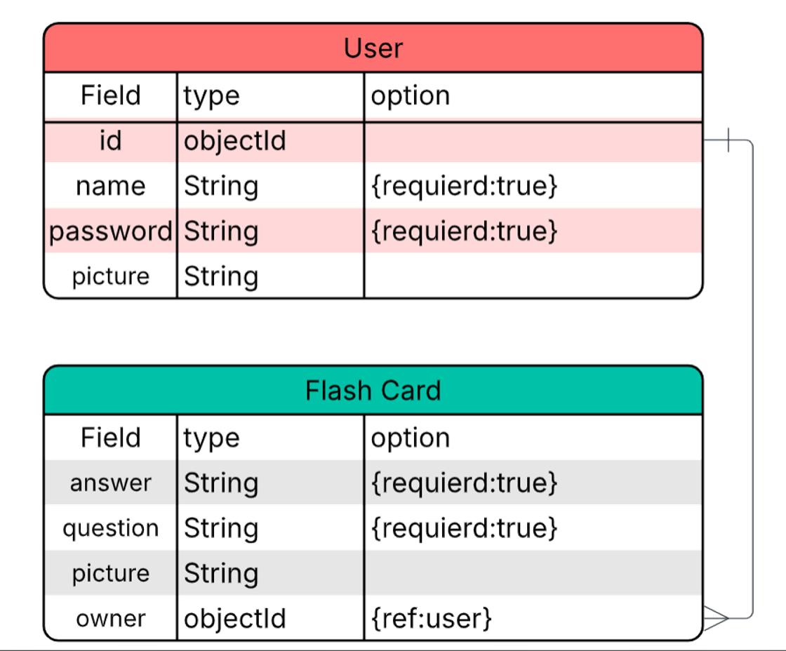
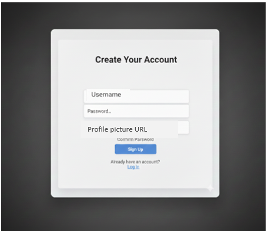
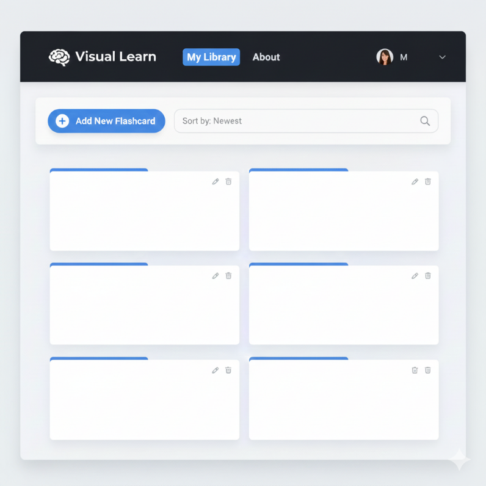
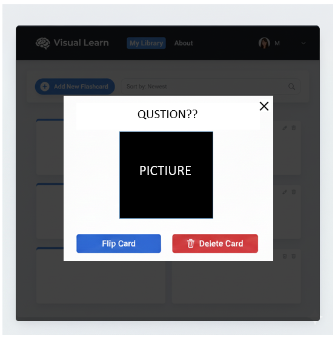
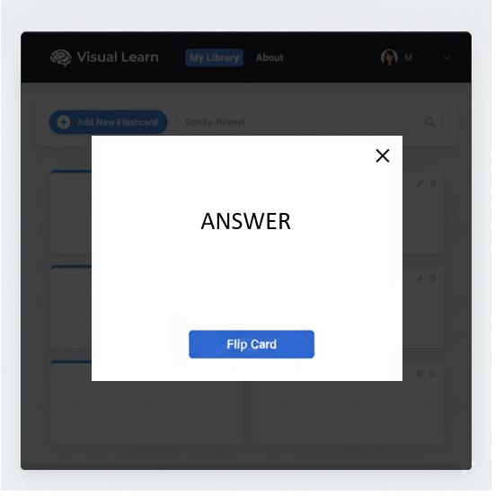
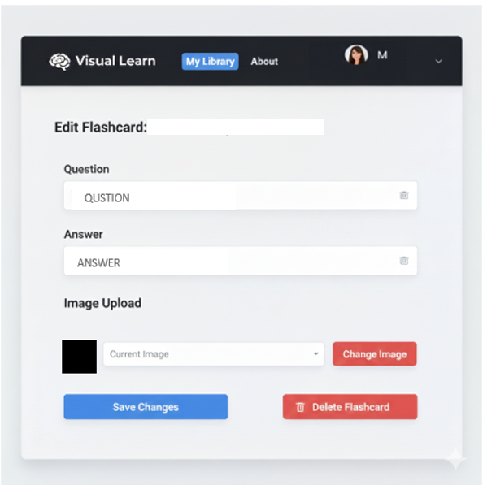

# Flash Card
**Idea:** 

To develop a personalized, web-based educational platform aimed at enhancing visual and active recall by enabling users to build their own custom library of question-and-answer content supported by images.

**ERD:**

This table illustrates the database structure and the relationships between the main entities (as shown in your ERD diagram):

| Entity | Field | Type | Notes |
| :--- | :--- | :--- | :--- |
| **User** | `name` | String | Required |
| **User** | `password` | String | Required  |
| **User** | `picture` | String | Profile Image URL |
| **Flashcard** | `question` | String | Required |
| **Flashcard** | `answer` | String | Required |
| **Flashcard** | `picture` | String | Illustrative Image URL (Optional) |
| **Flashcard** | `owner` | ObjectId | Linking the flashcard to its owner |

## Basic Mockups
### SING UP

### LOG IN

### SHOW PAGE

### QUSTION CARD

### ANSWER CARD

### UPDATE AND DELETE CARD

