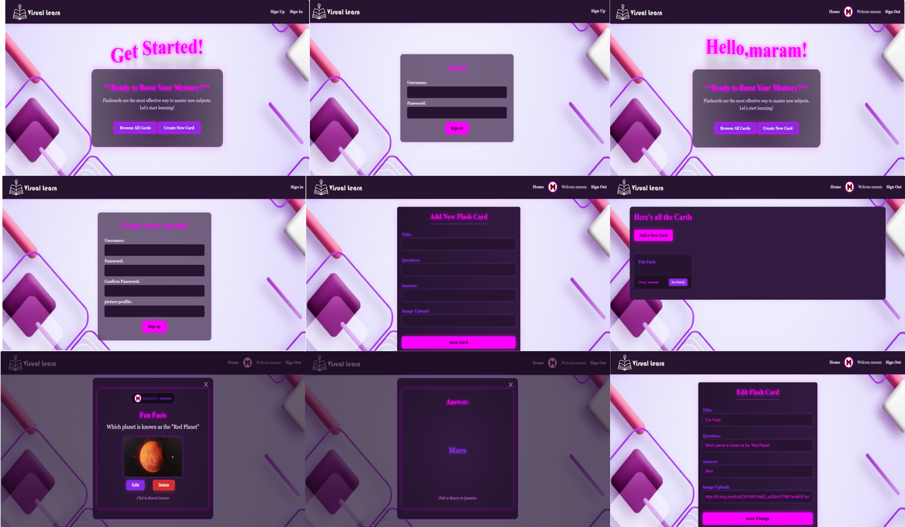

# 🧠 Flash Card App "Visual Learn" ⚡

## 🎨 Visual Learn Logo

  

___

## 📝 Description
 **Visual Learn** is a personalized, web-based educational platform designed to enhance learning through **Visual Memory** and **Active Recall**. It empowers users to create their own custom library of interactive question-and-answer flashcards supported by images.

### 🌟 Why I Built This
I created this app to provide a distraction-free, visually engaging environment for students to organize their study materials. It solves the problem of traditional boring flashcards by adding interactivity and personalized progress tracking.

### 🚀 Key Features
* **Interactive Study Mode:** Flashcards feature a 3D flip animation to reveal answers, simulating a real-life study experience.
* **Full CRUD Functionality:** Users can Create, Read, Update, and Delete their own flashcards.

* **Resource Authorization:** Robust middleware ensures that users can only edit or delete cards they created.

---
## ⚙️ How the App Works

This application follows the MVC (Model-View-Controller) architecture to manage a digital library of flashcards. Users can securely Sign Up and Log In using encrypted sessions to manage their personalized decks. The app provides Full CRUD functionality, allowing users to create new cards, view a responsive grid of existing ones, and update or delete their own data. A core feature of the app is Authorization; through custom middleware, the system ensures that only the creator of a flashcard can access the editing and deletion tools, protecting each user's content. The user interface is designed with CSS Grid for a modern layout and features interactive 3D flip animations to reveal answers, providing an engaging and accessible learning experience.

## 💻 Getting Started
* **Live Demo:** [View Deployed App]()
* **Planning Materials:** [Trello Board](https://b24-6j3t3m.bitrix24.ae/~lbWyq)

---

## 🛠 Technologies Used
* **Backend:** Node.js & Express.js
* **Database:** MongoDB Atlas with Mongoose ODM
* **Templating Engine:** EJS (Embedded JavaScript)
* **Security:** Bcrypt (Password Hashing) & Express-Session
* **Styling:** CSS (Advanced Flexbox & CSS Grid)
* **Middleware:** Method-Override, Morgan, Dotenv

---

## 🎨 Design & UI
* **Responsive Layout:** Built with **CSS Grid** to ensure a seamless experience across mobile, tablet, and desktop devices.
* **Modern Aesthetic:** Utilizes a dark-mode neon theme with high-contrast colors (Pink & Purple) following **WCAG 2.0** standards for readability.
* **Animations:** Custom CSS `@keyframes` for the bouncing welcome text and 3D transforms for the card-flipping mechanic.

---

## 📅 Next Steps (Stretch Goals)
* **Category Filtering:** Group flashcards by subjects (e.g., Programming, Language, Science).
*  **Search Bar:** Quickly search for cards by title or question keywords.

---

## 🧠 Project Reflection

### 🔴 The Most Challenging Part
**Complex CSS & Page Layouts:**
The most difficult part was mastering the CSS for custom layouts and ensuring the pages were responsive and visually balanced. Designing specific pages from scratch required a lot of trial and error to get the spacing, alignment, and overall aesthetic to match my vision.

### ✨ The Favorite Part
**Implementing Animations:**
The best part of the process was adding the animations. Seeing the "Welcome" text and other elements come to life gave the project a modern, professional feel. It was very satisfying to see how a few lines of code could transform a static page into an engaging user experience.

### 🟢 The Easiest Part
**Project Structuring:**
Setting up the initial project folders and basic HTML structure was the smoothest part, thanks to using the **MEN-AUTH-TEMPLATE**. It provided a solid foundation that allowed me to focus more on the visual features and logic.

---
## ✨ Final Look

    

---

## 📚 Attributions

* **Fonts:**  [Google Fonts](https://fonts.google.com).
* **Project Template:** Based on the **MEN-AUTH-TEMPLATE** by **Dujota** (SEB-11-BH), available at: [GitHub Repository](https://github.com/SEB-11-BH/MEN-AUTH-TEMPLATE).
* **Animated Welcome Design:** The animated greeting component was sourced from **Programmer Cloud** on YouTube, link: [Text Animation by Programmer Cloud](https://www.youtube.com/shorts/AUafNbgATw8).
---